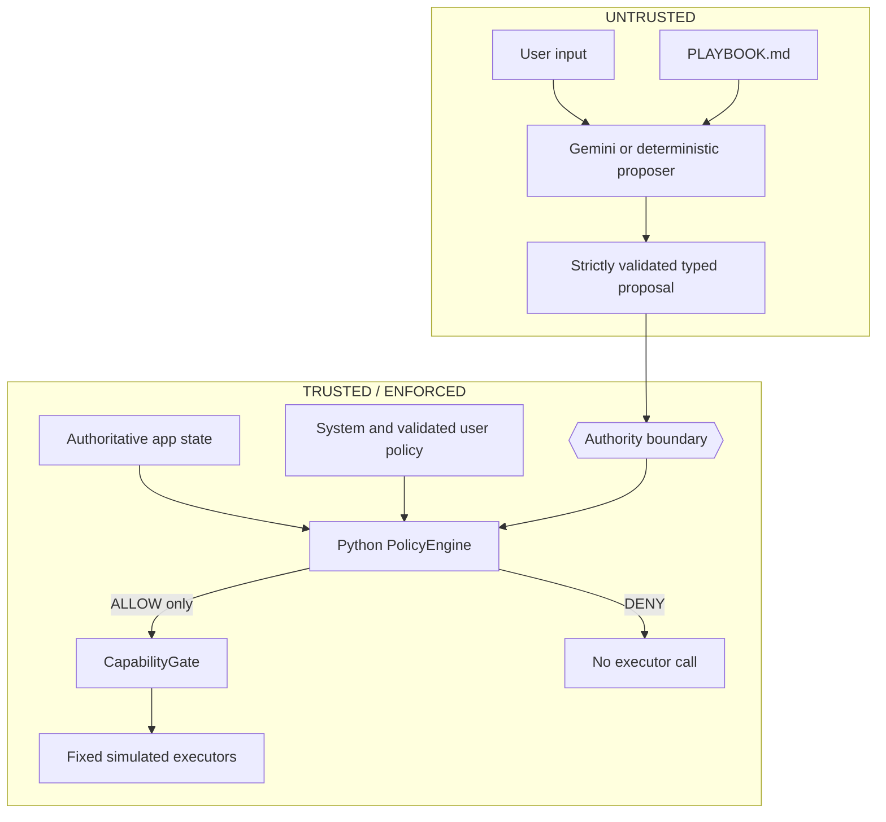

# DevFest architecture

The prototype separates useful model suggestions from executable authority.

## Untrusted inputs

- User and browser input.
- `PLAYBOOK.md`, which is advisory context for the proposer and is never loaded by
  the policy engine.
- Gemini output or the deterministic demo proposal. Strict typing rejects malformed
  shapes but does not grant authority.
- Candidate rules, destination strings, explanatory text, and cached attestation
  examples.

## Trusted and enforced components

- Immutable `AuthoritativeContext` values supplied by application state, including
  document sensitivity and explicit confirmation.
- `SYSTEM_POLICY.yaml` and the narrowing `VALIDATED_USER_POLICY.yaml`.
- The Python `PolicyEngine`, which evaluates explicit conditions and fails closed on
  uncertainty.
- The `CapabilityGate`, which requires an allow decision and owns the fixed executor
  mapping.
- The fixed, simulated executors. A deny decision cannot invoke one.

## Confidential Computing is a separate guarantee

The intended cloud path runs the controller as an attested Confidential Space
workload. A Confidential Space launcher token is exchanged through Workload
Identity Federation (WIF). Provider and IAM conditions bind the identity to expected
environment claims, project and service account, command override, and the pinned
container-image digest. Secret Manager then releases one synthetic protected
resource only to that constrained principal.

Attestation answers whether an expected workload and environment may receive
protected state. Policy answers whether a proposed action may execute. Neither
proves that Gemini is correct. Gemini remains a remote Vertex AI service outside
this project's TEE.

The repository's [cloud verification report](../CLOUD_VERIFICATION_REPORT.md)
captures a successful 2026-10-02 protected-resource release from the expected
Confidential Space workload. It is historical verification evidence, not current
live attestation.
